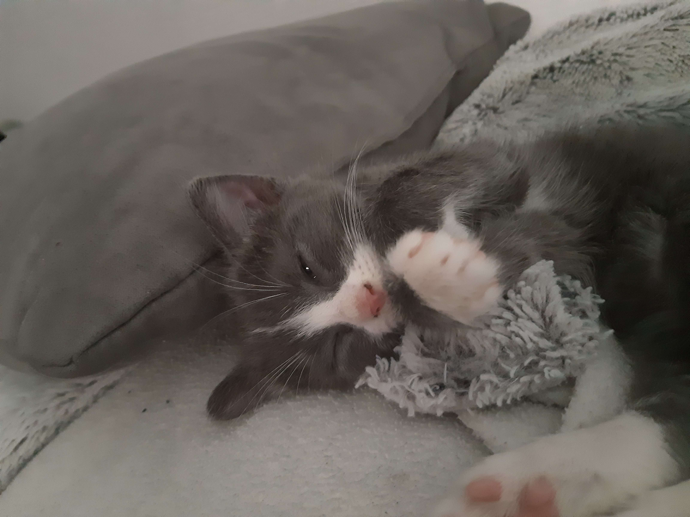

<h1 align="center">👋 Salut, moi c'est Mathis !</h1>

---

## 🧍 À propos de moi

<ul>
  <li> Étudiant en 2ème année de BUT informatique, parcours développement d'applications</li>
  <li> Stagiaire au service informatique des finances publiques de Strasbourg</li>
  <li> Mes passions :</li>
    <ul>
      <li>🎮 Jeux vidéo</li>
      <li>🎧 Écouter de la musique</li>
      <li>🎴 Jeux de carte à collectionner</li>
    </ul>
  <li> Je travaille avec :  </li>
    <ul>
      <li>🌐 HTML, CSS, JavaScript/TypeScript (React), PHP (Laravel)</li>
      <li>☕ Java : interfaces Swing, tests Junit</li>
      <li>📱 Android Studio (Java)</li>
      <li>🅲 C, C# (.NET)</li>
      <li>📊 SQL</li>
      <li>🤖 Godot Engine (GD Script)</li>
      <li>🐍 Python</li>
      <li>🐈 Scratch (pourquoi pas ?)</li>
    </ul>
</ul>

---

## ☕ Mes projets universitaires

<ul>
  <li>📂 AuditClicker : Création d'un jeu sérieux sur le thème des audits en entreprise, en GdScript (Godot), en binôme</li>
  <li>8️⃣ 2048 : Création d'un jeu de 2048 fonctionnant avec plusieurs processus communicant entre eux, en C, en trinôme</li>
  <li>🚢 Battleships : Création d'un jeu de bataille navale, en Java (Swing), en binôme</li>
  <li>🐉 Doojons-Dragons : Création d'un simulateur de partie de jeu de rôle, en Java, seul</li>
  <li>🚒 WaterForce : Création d'une application de gestion de casernes de pompiers, en .NET C#, en trinôme</li>
  <li>🖊️ AssemblySudoku : Création d'un résolveur de Sudoku, en assembleur, en binôme</li>
</ul>

---

## 🍪 Mes projets personnels

<ul>
  <li>🐈 ARandomGame : Création d'un jeu d'aventure 2D dans un monde fantastique, en GdScript (Godot), avec 4 amis</li>
</ul>

---

## 📫 Me contacter

- 💌 Email étudiant : [mathis.de-azevedo@etu.unistra.fr](mailto:mathis.de-azevedo@etu.unistra.fr)
- 💌 Email professionnel : [matdeazevedo@gmail.com](mailto:matdeazevedo@gmail.com)
- 💌 Email personnel : [mathisdeazevedo26@gmail.com](mailto:mathisdeazevedo26@gmail.com)
- 💻 Discord : [kitsune._.random](https://discord.com/)
- 📷 Instagram : [kitsu_____](https://www.instagram.com/kitsu_____/)
- ▶️ Youtube : [Kitsu](https://youtu.be/dQw4w9WgXcQ?si=2lMsfCQnMJjmoqrj)

---

## 🐈 Une photo de mon chat

